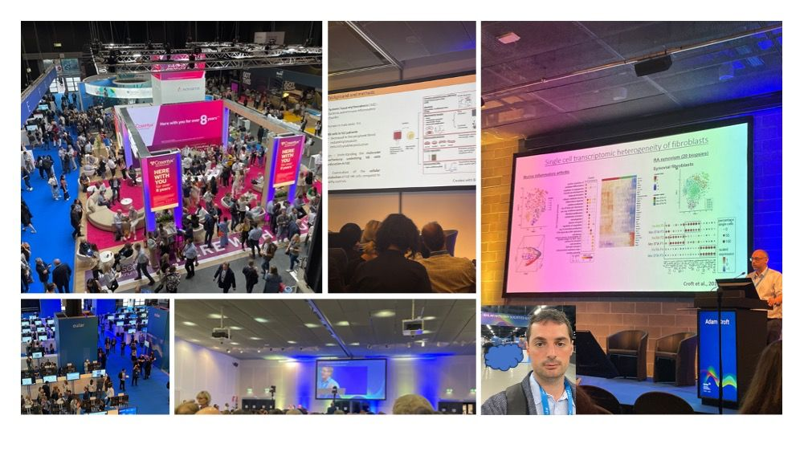

# EULAR2023 Spotlight: Molecular Discoveries from the Phase 2 Clinical Trial of Remibrutinib in Sjögren’s Syndrome

I’m excited to share the findings from our recent poster presentation at the [EULAR2023 conference](https://www.eular.org)! Our research focused on the exploratory biomarker analysis conducted on the remibrutinib Phase 2 clinical trial (LOUiSSE) in Sjögren’s syndrome (SjS).

In this double-blind, randomized, placebo-controlled study involving 73 patients with moderate to severe SjS, we evaluated the effects of remibrutinib, a selective inhibitor of Bruton Tyrosine Kinases. Our analysis encompassed transcriptomics and proteomics to gain comprehensive insights into the treatment’s impact.

One of the key discoveries was the downregulation of genes associated with B cell activation, including FCRL5 and SOX5, which were highly enriched in a subset of circulating tissue-like memory B-cells (Fig.1). Additionally, our proteomics analysis revealed significant downregulation of serum proteins, particularly FCRL4, associated with pathogenic B cells in SjS (Fig.2).

These findings suggest that remibrutinib holds promise as a disease-modifying therapy for Sjögren’s syndrome, extending its effects beyond B cell receptor signaling inhibition. Our research sheds light on the downregulation of genes and proteins associated with B cell activation and immunomodulatory pathways.
I would like to express my gratitude to the EULAR conference for providing this platform and to my colleagues for their valuable contributions. If you’re interested in learning more about our study or discussing potential implications, please feel free to reach out.

*Author Notes*

A brief description of SomaScan analysis is available on [medium](https://medium.com/@grioni.andrea/somascan-a-powerful-tool-for-proteomics-analysis-dc3481374436).

Please feel free to comment! you can also contact me at my [personal profile](https://andreagrioni.github.io) or on [LinkedIn](https://www.linkedin.com/in/agrioni/).

Thanks!