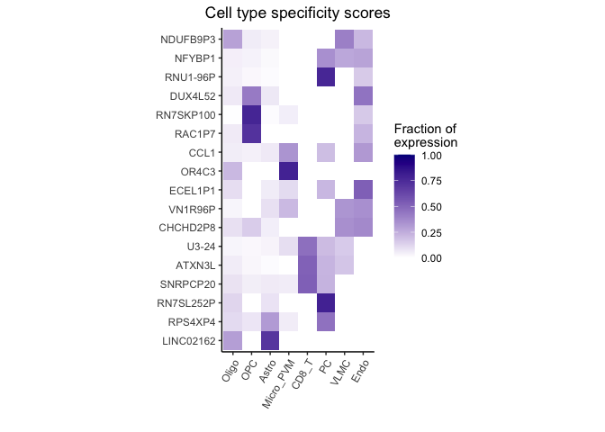

Mastering Single Cell RNA-Seq with Dreamlet
================
Andrea Grioni
2023/10/01

## Dreamlet: A Powerful Tool for Single Cell RNA-Seq Analysis with Linear Mixed Effect Models

------------------------------------------------------------------------

> **Note**: This summary is intended for a general audience and may omit
> some of the more technical details. Please see the [original
> publication](https://doi.org/10.1101/2023.03.17.533005) for details.

------------------------------------------------------------------------

1.  **The Problem**: Scientists are studying how genes are expressed in
    individual cells using a method called RNA-sequencing. However,
    these measurements can vary a lot due to random factors, such as the
    number of cells looked at or how the genes are read by the machine.
    So, they need a way to analyze this data in a manner that accounts
    for these variations.

2.  **Weighted Approach**: Imagine you’re trying to get an average score
    for a class based on test results. But some students have taken the
    test multiple times, while others only once. Instead of treating
    every score equally, you give more importance (or weight) to scores
    of students who took the test multiple times, because their average
    is likely more reliable. Similarly, in this method, scientists give
    more importance to data that comes from more cells or clearer
    machine readings.

3.  **Two Levels of Adjustments**:

    - **Cell Counts**: They first adjust based on how many cells they’ve
      looked at. Looking at more cells usually gives a clearer picture
      of gene expression.
    - **Gene Readings**: Next, they adjust based on the quality of
      machine readings for each gene. They use a popular technique
      called ‘voom’ to do this.

4.  **Refining with Bayes**: Lastly, they apply a special statistical
    trick, called “Empirical Bayes shrinkage”, to refine their results.
    This is like a teacher adjusting the grades of a class based on how
    the whole class performed. If everyone did poorly on a question, it
    might be adjusted to be worth fewer points, benefiting everyone.
    Similarly, this method “borrows” information from all genes to
    refine the data.

5.  **Why Do All This?**: This approach is powerful because it provides
    clearer insights into gene expression without being thrown off by
    random factors. Plus, it’s faster and more efficient than some
    traditional methods, which can struggle with this type of data.

In summary, scientists have a sophisticated method to study gene
expression in individual cells, adjusting for various factors to ensure
their findings are as accurate as possible!

------------------------------------------------------------------------

## Resources

Here a list of resource documenting the `dreamlet` package, which I used
to write this tutorial.

1.  [bioconductor talk](https://www.youtube.com/watch?v=n-pEkMkXmaU)
2.  [paper to
    reproduce](https://www.biorxiv.org/content/10.1101/2023.03.17.533005v1)
3.  [dataset source](https://www.synapse.org/#!Synapse:syn51188611)
4.  [github
    code](https://github.com/GabrielHoffman/dreamlet_analysis/blob/main/PsychAD_r0/PsychAD_r0_analysis.Rmd)
5.  [dreamlet package](https://gabrielhoffman.github.io/dreamlet/)

## Tutorial Description

[Hoffamn et
al.](https://www.biorxiv.org/content/10.1101/2023.03.17.533005v1.full.pdf)
performed single nucleus RNA sequencing (snRNA-seq) on postmortem brain
samples from the dorsolateral prefrontal cortex (DLPFC) of donors from
the Mount Sinai NIH NeuroBioBank. The study incorporated a large dataset
of 1.4M nuclei from 586 samples and 299 donors over 60 years of age,
with half being Alzheimer’s disease (AD) patients and the other half
age-matched neurotypical controls. Analysis revealed 22 distinct cell
types, including multiple subtypes of neurons. The [dreamlet
package](https://gabrielhoffman.github.io/dreamlet/) was employed to
model and analyze expression variance attributable to various factors
like technical replicates, age, AD status, and sample pooling.
Preliminary findings underscored the need for large sample sizes to
discern expression changes associated with AD. The study also emphasized
the significance of the batch effect due to sample multiplexing and its
potential impact on gene expression variance, highlighting dreamlet’s
capability to handle such complexities. A critical observation was the
relationship between the number of nuclei per subject and the technical
reproducibility of gene expression measurements. The dreamlet package
facilitated a detailed understanding of expression differences in
Alzheimer’s Disease.

## Glossary

*linear mixed effect model*: A linear mixed-effects model (or mixed
model in short) is a linear regression model with fixed effects and
random effects. It is useful in several situations, such as when we want
to model both fixed and random effects in the same analysis, or when we
have nested random effects (e.g., we have both random intercepts and
random slopes).

*pseudobulk*: “Pseudobulk” refers to a method used in single cell
RNA-Seq analyses where individual cell transcriptomes are aggregated
into groups, often based on cell type or other biological categories.
This aggregation effectively creates “virtual” bulk samples from single
cell data. The pseudobulk approach aims to increase statistical power by
reducing noise and leveraging the strengths of both single cell and bulk
RNA-Seq analysis methods. It’s particularly useful for differential
expression analyses where individual cell-level resolution might not be
necessary and where the increased power from aggregated data can be
beneficial.

*single nucleus RNA sequencign (snRNA-seq)*: Single-nucleus RNA
sequencing (snRNA-seq) is a method for analyzing the transcriptome of
individual cells that have been isolated from tissues. It is similar to
single-cell RNA sequencing (scRNA-seq), but instead of isolating
individual cells, nuclei are isolated from tissues and analyzed. This
allows for the study of cell types that are difficult to isolate, such
as neurons in the brain.

## Data description

In their study, Hoffman and his team shared a pseudobulk processed
version of the dataset saved as an RDS file. To follow along with this
tutorial, please download the dataset by clicking on the link: [Download
Dataset from Synapse](https://www.synapse.org/#!Synapse:syn51188611).
Additionally, if you’re interested in the more extensive raw dataset in
the h5ad file format, it’s available at the same link. Instructions for
loading and processing this dataset can be found in the authors’ GitHub
repository, which you can access
[here](https://github.com/GabrielHoffman/dreamlet_analysis/blob/main/PsychAD_r0/PsychAD_r0_analysis.Rmd).

------------------------------------------------------------------------

## Analysis

### Load libraries

``` r
library(dreamlet)
library(dplyr)
library(gtsummary)
library(ggplot2)
library(tidyr)
library(org.Hs.eg.db)
library(AnnotationDbi)
library(stringr)
library(patchwork)
library(purrr)
library(SingleCellExperiment)
```

### Load data

``` r
scRNA_path <- "../data/scRNA/PsychAD_r0_Dec_28_2022_pseudobulk.RDS"
pb <- base::readRDS(scRNA_path)
```

The analysis will be performed on a subset of the available cell types.

``` r
# select cell population of interest.
ctorder <- c('Oligo', 'OPC', 'Astro', 'Micro_PVM', 'CD8_T', 'PC', 'VLMC','Endo')
# filter
assays(pb) <- assays(pb)[ctorder]
```

## Data Exploration

I am using [gtsummary](https://www.danieldsjoberg.com/gtsummary/) to
summaryze the data. I am interested in the distribution of the following
variables: Sex, Age, and Dx (diagnosis).

``` r
df <- colData(pb) |>
  as_tibble(rownames = "sampleid") |>
  dplyr::select(sampleid, SubID, Dx, sex = Sex, age = Age)
```

The results are shown below. It will confirm that we will work with 149
control and 150 AD samples. The age and sex distribution are also
balanced between the two groups.

``` r
df |>
  dplyr::select(-sampleid) |>
  dplyr::distinct() |>
  tbl_summary(
    include = c(Dx, sex, age),
    by = Dx
  ) |>
  add_p()
```

| **Characteristic** | **Control**, N = 149 | **AD**, N = 150 | **p-value** |
|:-------------------|:--------------------:|:---------------:|:-----------:|
| sex                |                      |                 |    \>0.9    |
| Female             |       70 (47%)       |    71 (47%)     |             |
| Male               |       79 (53%)       |    79 (53%)     |             |
| age                |     76 (69, 85)      |   78 (72, 85)   |     0.2     |

First, create a contingency table and then perform a Chi-squared test.
This test aims to ascertain if there’s a notable link between gender
(Male/Female) and the treatment group (Control/AD). The null hypothesis
posits no association between the two variables, while the alternative
hypothesis assumes a connection.

``` r
tab <- table(df$sex, df$Dx)
chisq.test(tab)
```


        Pearson's Chi-squared test with Yates' continuity correction

    data:  tab
    X-squared = 2.8825e-05, df = 1, p-value = 0.9957

The chi-squared test’s results suggest no significant relationship
between gender and the treatment group in the dataset. The even
distribution of individuals in both groups, highlighted by a p-value of
1 and an X-squared value of 0, reinforces this finding.

Second, perform a t-test to determine if there’s a significant
difference in age between the two groups. The null hypothesis assumes no
difference in age between the two groups, while the alternative
hypothesis assumes a difference.

``` r
cor.test(df$age, as.numeric(df$Dx))
```


        Pearson's product-moment correlation

    data:  df$age and as.numeric(df$Dx)
    t = 1.696, df = 584, p-value = 0.09042
    alternative hypothesis: true correlation is not equal to 0
    95 percent confidence interval:
     -0.01104875  0.15015365
    sample estimates:
           cor 
    0.07000949 

The Pearson’s correlation test for the dataset’s age and Dx yielded a
coefficient of \~0.0676, indicating a weak positive relationship.
However, with a p-value of 0.2436, surpassing the 0.05 significance
level, this correlation isn’t statistically significant. The 95%
confidence interval (-0.0461 to 0.1797) spanning 0 reinforces this
conclusion.

In conclusion, no significant correlation exists between age and Dx.
Lastly, it’s essential to detect outliers, as they can significantly
influence statistical results.

``` r
# Calculate the quartiles
Q1 <- quantile(df$age, 0.25)
Q3 <- quantile(df$age, 0.75)

# Compute the Interquartile Range (IQR)
IQR <- Q3 - Q1

# Detect outliers
outliers <- df$age[(df$age < (Q1 - 1.5 * IQR)) | (df$age > (Q3 + 1.5 * IQR))]

# Print the detected outliers
print(outliers)
```

    numeric(0)

Fortunately, no outliers were detected in the dataset. Finally, I would
like to save the samples ID of Control and AD groups in two separate
vectors.

``` r
# Control group
control <- df |> dplyr::filter(Dx == "Control") |> dplyr::pull(sampleid)
# AD group
ad <- df |> dplyr::filter(Dx != "Control") |> dplyr::pull(sampleid)
```

In conclusion, the dataset is balanced between the control and AD groups
in terms of age and sex distribution.

## Quality Control and Preprocessing

First we extract the read counts for each Channel/celltype from the
`SingleCellExperiment` object. Then we combine them into one data.frame
and make celltype a factor. This will help us to order the violin plots.

``` r
# Extract read counts for each Channel/celltype
df_counts <- map_dfr(ctorder, function(x) {
  data <- assay(pb, x)
  data.frame(
    celltype = x,
    ID = colnames(data),
    readCounts = Matrix::colSums(data)
  )
})

# Convert celltype to a factor with the specified order
df_counts$celltype <- factor(df_counts$celltype, levels = ctorder)
```

Removing cells with 0 reads.

``` r
df_counts <- df_counts[df_counts$readCounts > 0, ]
```

Generate violin plot to visualize the distribution of reads count for
each CellType.

``` r
# Generate violin plot to visualize the distribution of read counts for each cell type
ggplot(df_counts, aes(x = celltype, y = readCounts, fill = celltype)) +  
  # Violin plot
  geom_violin() + 
  
  # Boxplot inside violin
  geom_boxplot(width = 0.1, outlier.size = 0.1) +
  
  # Theme and aesthetics
  theme_bw() + 
  theme(
    aspect.ratio = 1, 
    plot.title = element_text(hjust = 0.5),
    legend.position = "none",
    axis.title.y = element_blank()
  ) + 
  
  # Log scale for y-axis
  scale_y_log10() +
  
  # Horizontal layout
  coord_flip() +
  
  # Labels and title
  labs(
    y = "Number of reads observed for each CellType",
    x = NULL,
    title = 'Reads per cell cluster for each CellType'
  )
```


Show the normalized reads for cell ratio.

``` r
# Convert cell counts to dataframe and pivot to longer format
df_rate <- cellCounts(pb) |>
  as_tibble(rownames = "ID") |>
  tidyr::pivot_longer(cols = -ID, values_to = "ncells", names_to = "celltype") |>
  dplyr::mutate(celltype = factor(celltype, ctorder))

# Join dataframes and compute normalized reads
df_joined <- df_counts |>
  dplyr::inner_join(df_rate, by = c("celltype", "ID")) |>
  dplyr::mutate(normalizedReads = readCounts/ncells)
```

Generate the violing plot.

``` r
# Create a violin plot to visualize the normalized read counts for each 'celltype'
df_joined |>
  ggplot(aes(celltype, normalizedReads, fill = celltype)) +  
    # Display distribution of normalized read counts using a violin plot
    geom_violin(color = NA) + 
    # Add a boxplot inside the violin plot for a summarized view
    geom_boxplot(width = 0.1, outlier.size = 0.1) +
    # Use the classic theme for a polished appearance
    theme_classic() + 
    # Adjust theme settings for optimal visualization
    theme(
      aspect.ratio = 1, 
      plot.title = element_text(hjust = 0.5),
      legend.position = "none"
    ) + 
    # Apply a log scale to the y-axis for better data representation
    scale_y_log10() +
    # Present the plot horizontally for clarity
    coord_flip() +
    # Define labels for the plot
    labs(
      y = 'Normalized Reads (Reads per cell)', 
      x = NULL, 
      title = 'Normalized Reads per Cell for Each Channel'
    )
```


Evaluate the specificity of each gene for each cell type. The function
calculates the proportion of each gene’s expression that is specific to
individual cell types, retaining only highly expressed genes:

``` r
df <- cellTypeSpecificity( pb )

plotViolin(df, assays=ctorder)
```


Create a tibble with columns gene, totalCPM, cellType, and CPM count.
Then, group by celltype and calculate the percentage of each gene’s
expression that is specific to individual cell types. Finally, sort the
data by totalCPM in descending order and sample the top 3 genes.

``` r
# Process the 'df' dataframe to extract top marker genes for each cell type
my_markers <- df |> 
  # Convert the dataframe to a tibble and assign row names to 'gene' column
  tibble::as_tibble(rownames = "gene") |>

  # Exclude rows with 'gene' values containing the pattern "ENSG"
  dplyr::filter(!str_detect(gene, "ENSG")) |>

  # Transform the dataframe to a long format, with 'cellType' and 'CPM' columns
  tidyr::pivot_longer(
    cols = !c(gene, totalCPM), 
    names_to = "cellType", 
    values_to = "CPM"
  ) |>

  # Compute the percentage of CPM for each gene relative to 'totalCPM'
  dplyr::mutate(percentCPM = CPM / totalCPM * 100) |>

  # Organize data by 'cellType' and order within each group by 'percentCPM'
  dplyr::group_by(cellType) |>
  dplyr::arrange(desc(percentCPM)) |>

  # Retain only the top 3 genes for each cell type
  dplyr::slice(1:3) |>

  # Keep only the 'cellType' and 'gene' columns
  dplyr::select(cellType, gene) |>

  # Eliminate any repeated rows
  dplyr::distinct() |>

  # Convert the tibble to a named vector with 'cellType' as names and 'gene' as values
  tibble::deframe()
```

Use extracted cell markers from `my_markers` and represent them with
barplots.

``` r
# Use the 'select' function from the AnnotationDbi package to map ENSEMBL IDs to gene SYMBOLs
df_genes <- AnnotationDbi::select(
  org.Hs.eg.db, 
  keys = my_markers, 
  columns = "ENSEMBL", 
  keytype = "SYMBOL"
)
```

    'select()' returned many:1 mapping between keys and columns

``` r
# Filter the 'df' dataframe to retain only the rows corresponding to the ENSEMBL IDs in 'df_genes'
df_sub <- df[rownames(df) %in% df_genes$ENSEMBL, ]

# Match the row names of 'df_sub' with the ENSEMBL IDs in 'df_genes' and replace them with corresponding gene SYMBOLs
idx <- match(rownames(df_sub), df_genes$ENSEMBL)
rownames(df_sub) <- df_genes$SYMBOL[idx]

# Plot percent bars for the specified genes and assays
plotPercentBars(df, genes = unique(my_markers), assays = ctorder)
```


The `Dreamlet` package provides a function to generate heatmap from a
selected list of genes.

``` r
dreamlet::plotHeatmap(
  df,
  genes=unique(my_markers),
  assays=ctorder)
```



## Modelling

In this tutorial, we’ll walk you through the process of transforming raw
gene expression data to log2 Counts Per Million (CPM) and then applying
“voom” precision weights. Voom, a method from the `limma` package, is
crucial for RNA-Seq data analysis as it estimates the mean-variance
relationship of log-counts and computes precision weights for each
observation.

### Step 1: Define the Model for Normalization

The normalization process is a crucial step in preparing data for
downstream analyses, especially in genomics. We aim to adjust for
various factors that might influence gene expression readings, ensuring
the results we observe later are due to our conditions of interest and
not confounded by other variables.

``` r
# Create a formula for normalization
form = ~ (1|SubID) + (1|poolID) + Sex + scale(Age) + Dx
```

Here’s what each component of the formula represents:

- (1\|SubID): This introduces a random effect for each individual
  subject or sample (SubID). When you incorporate random effects, it
  means you’re accounting for inherent variability between different
  subjects, but not necessarily estimating the effect of each specific
  subject. This is particularly useful if you believe each subject has
  its unique baseline characteristics that might influence gene
  expression but are not of primary interest.

- (1\|poolID): Similar to SubID, this term introduces a random effect,
  but for each batch or pool (poolID). In many genomics experiments,
  samples are processed in batches, and each batch could introduce its
  variability due to technical nuances. By adjusting for this, we ensure
  that batch effects don’t confound our results.

- Sex: This is a fixed effect for the sex of the subjects. Fixed effects
  are factors for which we explicitly estimate and test their impact on
  the outcome. By including Sex, we’re saying that the gender of the
  subjects might influence gene expression, and we want to adjust for
  any differences that arise due to gender.

- scale(Age): This term also represents a fixed effect, but for the age
  of the subjects. Age values are scaled (standardized) here, which
  means each age value is subtracted from the mean age and then divided
  by the standard deviation of age. This standardization ensures that
  the age variable is on a similar scale as other predictors in the
  model. It helps in stabilizing the model and makes interpretations
  more straightforward.

- Dx: This introduces another fixed effect for the diagnosis (Dx). By
  incorporating this term, we’re accounting for potential differences in
  gene expression that arise due to various diagnoses. We’re explicitly
  interested in testing and estimating the impact of different diagnoses
  on gene expression.

In summary, this formula provides a comprehensive framework for
normalization, taking into account subject variability, batch effects,
and other important factors like age, sex, and diagnosis. By using this
formula, we’re ensuring a robust normalization that paves the way for
more reliable downstream analyses.

``` r
# Normalize and apply voom
res.proc <- processAssays(pb, form)
```

Voom stands for Variance modeling at the observational level. Voom is a
method within the limma package designed for RNA-sequencing (RNA-seq)
data analysis. It addresses the challenge of RNA-seq data being
count-based and having a mean-variance relationship. In essence, voom:

1.  Transforms RNA-seq counts to log2-counts per million (logCPM),
    making the data more continuous.
2.  Estimates the mean-variance relationship inherent in RNA-seq data.
3.  Calculates weights for each observation based on this relationship.
4.  Uses these weights in linear modeling to identify differentially
    expressed genes.

Below I will show the voom plot for each cell type. It will show that
low expressed genes have an higher variance in almost all cell types.

``` r
plotVoom(
  res.proc,
  ncol=4,
  assays=ctorder
  ) + 
  theme_classic()  
```


### Step 3: Variance Partitioning Analysis

The variance partitioning analysis provides a tools to assess quality
control of the experiment and to identify the main sources of variation.
The function `fitVarPart` fits a linear mixed model to the data and
estimates the variance components for each random effect. The function
`plotVarPart` plots the variance components for each random effect. The
function `plotPercentBars` plots the percent of variance explained by
each random effect for each gene. The function `plotGeneHeatmap` plots
the heatmap of the percent of variance explained by each random effect
for each gene. The function `plotForest` plots the forest plot of the
percent of variance explained by each random effect for each gene.

``` r
# define formula
form <- ~ (1|SubID) + (1|poolID) + Sex + scale(Age) + Dx
# run model
res.vp <- fitVarPart(res.proc, form)
```

The variance partition plots represent the contribution to the total
variation for each cell type. In this plot, we can see that most of the
variation is originitated by the SubID and poolID. The Dx (diagnosis)
and Age are the least important factors.

``` r
plotVarPart(
  sortCols(res.vp),
  label.angle=45,
  ncol=4,
  assays=ctorder
  )  
```


The same plot can be generated at gene level. In this case, we can see
that the gene KCNMA1 variance originates by the SUBJID, while the gene
XIST has a higher variance due to the SEX covariate. CECR2 and PTPRG
have a higher variance due to the SUBJID covariate, but there is also
significant contribution from the diagnosis of the subject.

``` r
# Define a list of genes of interest
genes <- c("KCNMA1", "CECR2", "PTPRG", "NXPE1", "XIST", "NDUFB6")

# Filter the 'res.vp' dataframe to retain only the rows corresponding to the genes of interest and the assay 'Micro_PVM'
#df.vp.sub <- res.vp[(res.vp$gene %in% genes) & (res.vp$assay == "Micro_PVM"), ]
df.vp.sub <- res.vp[(res.vp$gene %in% genes), ]
# Reorder the 'gene' factor levels based on the predefined 'genes' list and sort the dataframe by this order
df.vp.sub$gene <- factor(df.vp.sub$gene, levels = rev(genes))
df.vp.sub <- df.vp.sub[order(df.vp.sub$gene, decreasing = TRUE), ]

# Define a color palette for the plot
col <- c(RColorBrewer::brewer.pal(ncol(df.vp.sub) - 3, "Set1"), "grey85")

# Create a percent bar plot using the filtered data and the specified color palette
fig.percent <- plotPercentBars(df.vp.sub, assays = ctorder, col = col, ncol=5) + 
  theme(aspect.ratio = 1)

# display figures
fig.percent
```


One of the main advantages of the dreamlet package is the ability to
model batch effects and visualize it. Here an example of how batch
effects contribute to the variation of the gene expression for each cell
type.

``` r
# Visualize the distribution of variance explained by 'poolID' for each assay using a violin plot
res.vp |>
  # Convert the data to a tibble format
  as_tibble() |>
  # Reorder the 'assay' factor levels based on the predefined 'ctorder' list
  mutate(assay = factor(assay, levels = ctorder)) |>
  # Plot the data
  ggplot(aes(x = 100 * poolID, y = assay)) + 
    # Add a violin plot to visualize the distribution
    geom_violin(fill = "#984EA3", scale = "area") +
    # Overlay a boxplot for a summarized view
    geom_boxplot(width = 0.1, outlier.color = "#984EA3") +
    # Use the classic theme for a polished appearance
    theme_classic() +
    # Adjust theme settings for optimal visualization
    theme(
      aspect.ratio = 1, 
      plot.title = element_text(hjust = 0.5)
    ) +
    # Define labels for the plot
    labs(
      x = "Variance explained (%)", 
      y = NULL, 
      title = "10X pool"
    )
```


# Differential expression: dreamlet analysis

The dreamlet package offers a sophisticated approach tailored for
single-cell and single-nucleus RNA-sequencing data. It not only
identifies differentially expressed genes but also accounts for various
technical and biological factors that can influence gene expression
measurements. By modeling and analyzing expression variance attributable
to factors like technical replicates, age, disease status, and sample
pooling, dreamlet provides a more comprehensive view of the
transcriptomic landscape.

In this example, we are interested in comparing the control and disease
groups to identify differentially expressed genes for each cell type.
The model will include SUBJID and poolID as random effect. We considered
sex and age as a fixed effect.

``` r
form = ~ (1|SubID) + (1|poolID) + Sex + scale(Age) + Dx
fit = dreamlet( res.proc, form)
```

## Volcano

Generate volcano plot for each cell type. The plotVolcano function uses
defalt paramenters `threshold = 0.005` and `l2fc = 2`.

``` r
plotVolcano(fit, "Dx", ncol=5, assays=ctorder) + theme_classic()
```


## Highlight genes

Cell type gene markers can be provided to easily generate an heatmap.

``` r
genes <- c("DUSP10", "PTPRG", 'NPNT', 'DPYD', "VGF", 'SPRY4-AS1', "PDE10A", "NCAM2", 'PCDH7') 
fig.gene_heatmap <- plotGeneHeatmap( fit, coef="Dx", genes=genes, assays=ctorder)  
fig.gene_heatmap
```


A forest plot can be generated to identify the fold change variation for
selected genes across the cell populations.

``` r
# Create a list of forest plots for each gene of interest
figList <- lapply(genes, function(g) {  
  plotForest(fit, coef = 'Dx', gene = g, assays = ctorder) +
    # Adjust the plot's appearance for optimal visualization
    theme(
      aspect.ratio = 1, 
      legend.position = "none"
    ) 
})

# Assign gene names to the list of plots for easy identification
names(figList) <- genes

# Arrange the individual plots in a grid layout with 2 columns
wrap_plots(figList, ncol = 3)
```


It is also possible to visualize the distribution of the gene expression
for each cell type between our control and AD groups.

``` r
# Define a named vector associating genes with their respective cell types
gene_CT <- c(
  "PTPRG" = "Micro_PVM", 
  'NPNT' = "Astro", 
  'DPYD' = "Micro_PVM"
)

# Create a list of boxplots for each gene, showcasing their expression in different conditions
figList <- lapply(names(gene_CT), function(g) {
  
  # Extract relevant data for the current gene and its associated cell type
  df <- extractData(res.proc, gene_CT[g])
  df <- df[, c('Dx', g)]
  
  # Recode the 'Dx' column for better readability in plots
  df$Dx <- factor(
    df$Dx,
    levels = c(0, 1),
    labels = c("Control", "AD")
  )
  
  # Rename the gene column to a generic name for easier plotting
  colnames(df)[colnames(df) == g] <- "expr"
  
  # Create a boxplot for the current gene's expression across conditions
  ggplot(df, aes(Dx, expr, fill = Dx)) +
    geom_boxplot() +
    theme_classic() +
    theme(
      aspect.ratio = 1, 
      plot.title = element_text(hjust = 0.5), 
      legend.position = "none"
    ) +
    labs(
      title = paste0(gene_CT[g], ": ", g),
      y = expression(log[2]~CPM),
      x = NULL
    ) +
    scale_fill_manual(values = c("grey50", "red3"))
})

# Assign gene names to the list of plots for easy identification
names(figList) <- names(gene_CT)

# Arrange the individual plots in a grid layout with 3 columns
wrap_plots(figList, ncol = 3)
```


## Conclusion

Throughout this tutorial, we’ve embarked on an introduction into single
cell RNA-Seq analysis, specifically leveraging the capabilities of the
Dreamlet package. We’ve seen firsthand how Dreamlet effectively models
batch effects, ensuring that our data remains uncompromised by unwanted
technical variations. This approach is useful when dealing with
biological and technical replicates that we want to take into account
for our analysis. Moreover, by pinpointing the exact sources of
variation for each cell type and gene of interest, we’ve gained a
nuanced understanding that goes beyond traditional analysis methods.
Finally, we’ve seen how Dreamlet can be used to identify differentially
expressed genes, accounting for various factors that might influence
gene expression measurements. This approach is powerful because it
provides clearer insights into gene expression without being thrown off
by random factors. Plus, it’s faster and more efficient than some
traditional methods, which can struggle with this type of data.

------------------------------------------------------------------------

## *Author Notes*

In this article, I’ve offered a glimpse into the projects I’ve engaged
with at Novartis Biomedical Research. While the insights shared are
rooted in scientific studies and open datasets available to the public,
it’s crucial to note that they are utilized here purely as illustrative
examples and are not directly affiliated with Novartis Biomedical
Research. Your feedback and comments are highly valued. For additional
information or to connect with me, please visit my [personal
page](https://andreagrioni.github.io).
