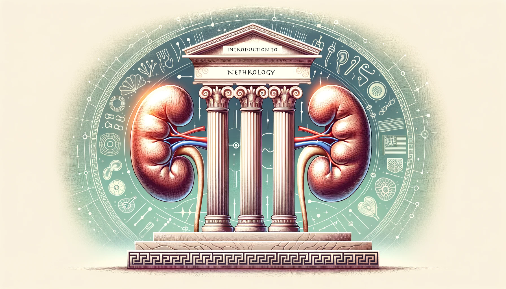
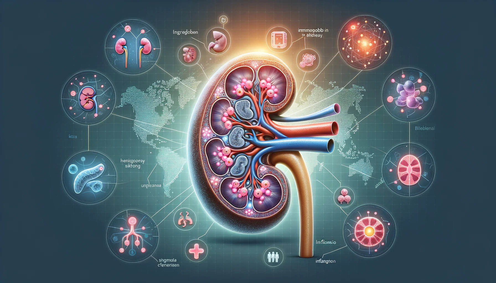

# Nephrology: The Study of Kidneys and Kidney Week 2023

## Introduction to Nephrology
Originating from the ancient Greek word 'nephros' meaning kidney, nephrology is a specialized medical discipline dedicated to the diagnosis, treatment, and management of kidney diseases. This field covers a spectrum of conditions, from acute kidney injuries to chronic kidney diseases, delving into the kidney's anatomy, physiology, and related disorders.

## Kidney Diseases: An Integrated Overview

------------------------------------------------------------------------

> Summary of the review "Daina E, Cortinovis M, Remuzzi G. Kidney diseases. Immunol Rev. 2023 Jan;313(1):239-261. doi: 10.1111/imr.13167. Epub 2022 Nov 12. PMID: 36369988; PMCID: PMC10099622."

------------------------------------------------------------------------

### Clinical Trials and Kidney Diseases
The world of kidney diseases has been a focal point of extensive research and clinical trials. These endeavors aim to unearth novel treatments, deepen our understanding of disease progression, and enhance patient outcomes. The dynamic landscape of nephrology is punctuated by pioneering research, especially spotlighting conditions like aHUS, a rare but significant kidney ailment.

### Treatment and Monitoring
The treatment landscape for kidney diseases is both vast and evolving. Drugs like Eculizumab have emerged as beacons of hope, showing potential in enhancing kidney function. Yet, challenges persist, especially in determining optimal treatment durations and monitoring protocols. Combination therapies, including the pairing of prednisone with ACE inhibitors, and the use of corticosteroids, have undergone rigorous evaluations to ascertain their efficacy. Emphasizing the significance of timely monitoring and early diagnosis is paramount, as these can be game-changers in altering disease trajectories.

### The Genetic Landscape
Genetics casts a long shadow over kidney diseases. In conditions like aHUS, specific genes, such as Factor B and C3, have been spotlighted for their influence on kidney health. In the realm of IgA Nephropathy, the emergence of galactose-deficient IgA1, a genetic anomaly, has been identified as a cornerstone in the disease's pathogenesis.

### Awareness and Broader Implications
Elevating awareness about kidney diseases is not just essential—it's imperative. Early diagnosis, coupled with a nuanced understanding of potential outcomes, can reshape the nephrology field. Research insights not only equip medical professionals with better tools but also empower patients, enabling them to make informed health decisions.

---

## Zooming into IgA Nephropathy (IgAN)

------------------------------------------------------------------------

> Summary of the review "Floege J, Rauen T, Tang SCW. Current treatment of IgA nephropathy. Semin Immunopathol. 2021 Oct;43(5):717-728. doi: 10.1007/s00281-021-00888-3. Epub 2021 Sep 8. PMID: 34495361; PMCID: PMC8551131."

------------------------------------------------------------------------
### Understanding IgA Nephropathy
Often dubbed Berger's disease, IgA Nephropathy is characterized by the antibody immunoglobulin A (IgA) lodging within the kidneys. This leads to inflammation, which over time can compromise the kidneys' filtration capabilities. Recognized globally as a prevalent kidney disease, its intricacies are still being unraveled.

### Disease Dynamics
IgAN is marked by the accumulation of IgA deposits in the kidneys, triggering inflammation and subsequent damage. Symptoms can range from the presence of blood and protein in urine to elevated blood pressure and diminished kidney functionality. While the root cause of IgAN remains elusive, prevailing theories suggest a multi-step process involving abnormal IgA production, immune complex formation, and their eventual deposition in the kidneys.

### Genetics and Molecular Insights
The genetic tapestry of IgAN is intricate. While research is ongoing, it's clear that certain genetic markers predispose individuals to this disease. The spotlight often falls on galactose-deficient IgA1, a molecular anomaly in IgAN, believed to be a catalyst for immune complex formation and kidney deposition.

### Biomarkers in Focus
Biomarkers serve as invaluable tools in diagnosing, monitoring, and prognosticating IgAN. Key biomarkers include:
- **Serum Galactose-Deficient IgA1 Levels**: Elevated levels signal the presence and potential severity of IgAN.
- **MicroRNAs**: These are under investigation for their role in disease progression and diagnostic potential.
- **eGFR (estimated Glomerular Filtration Rate)**: A pivotal measure of kidney function, eGFR provides insights into the kidneys' filtration efficiency. In the context of IgAN, a declining eGFR can be indicative of disease progression and is crucial for gauging kidney damage severity.

As the narrative of IgA Nephropathy continues to evolve, research is shedding light on its many facets. The aspiration is that as we deepen our understanding of its genetics, molecular aspects, and potential biomarkers, we'll pave the way for more precise and effective treatments.

---

## ASN Kidney Week 2023: A Confluence of Nephrology Experts

Recognized as the world’s premier nephrology gathering, ASN Kidney Week offers attendees a vibrant platform to exchange knowledge, engage in thought-provoking discussions, and stay abreast of the latest scientific and medical breakthroughs. With experts from every corner of the globe, the event promises a rich tapestry of insights, research findings, and innovative approaches to kidney care. Whether one is a seasoned nephrologist, a budding researcher, or someone passionate about kidney health, ASN Kidney Week 2023 in Philadelphia promises to be an enlightening and enriching experience. It's an opportunity for professionals and enthusiasts alike to come together, share, learn, and pave the way for a brighter future in nephrology.

More information [here](https://www.asn-online.org/education/kidneyweek/2023/meeting-overview.aspx)

---

## Author Notes
In this article, I’ve provided an overview of nephrology, with a particular focus on IgA Nephropathy, and highlighted the significance of the upcoming ASN Kidney Week 2023. While the insights shared are rooted in scientific studies and open datasets available to the public, it’s crucial to emphasize that they are utilized here purely as illustrative examples and are not directly affiliated with any specific research institution or company. Your feedback and comments are highly valued. For additional information or to connect with me, please visit my [personal page](https://andreagrioni.github.io).