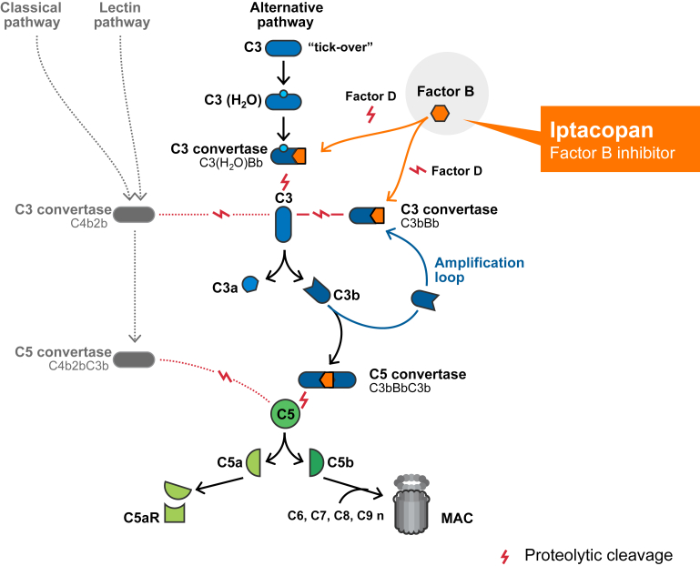
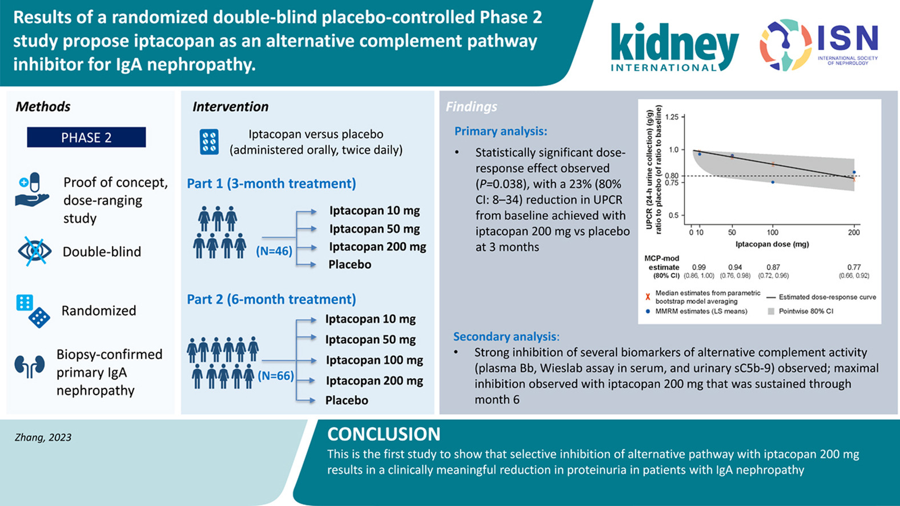
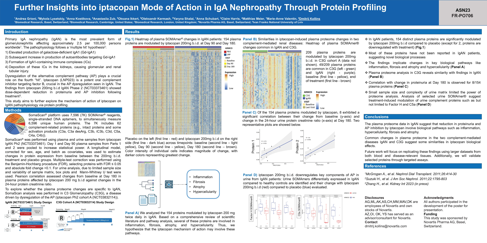

# **IgA Nephropathy (IgAN) and the Promise of Iptacopan: Insights from a Phase 2 Clinical Trial**

## **Glossary**
- **Proteinuria**: The presence of excess proteins in the urine. It is often a sign of kidney damage.
- **eGFR (estimated Glomerular Filtration Rate)**: A test that measures how well the kidneys are filtering blood. It's an estimate of the filtering capacity of the kidneys.
- **Glomerulonephritis**: A type of kidney disease where the glomeruli, tiny filters in the kidneys, become inflamed, affecting the kidney's ability to filter waste and fluids.

## **Introduction**
IgA Nephropathy (IgAN), the most common form of glomerulonephritis, is characterized by the deposition of galactose-deficient IgA in the glomerular mesangium. With a global incidence of approximately 25 per million per year, it predominantly affects young adults. Alarmingly, around 15–40% of IgAN patients may progress to kidney failure within a decade or two post-diagnosis, emphasizing the urgent need for effective treatments.

## **Current Therapeutic Landscape**
Despite advances in understanding IgAN's pathogenesis, the therapeutic landscape had been barren of disease-specific treatments until recently. Many patients grapple with residual proteinuria and remain at high risk of disease progression, even with optimal supportive care. The potential toxicity of corticosteroid-based treatments has amplified the need for safer, more targeted therapies.

## **The Complement System & IgAN**
Central to IgAN is the dysregulation of the complement system. The formation of immune complexes and their deposition in the glomerular mesangium can activate the complement system, particularly the alternative complement pathway. This activation is believed to play a pivotal role in IgAN's onset and progression. Histological findings have revealed mesangial C3 deposition alongside IgA1 containing immune complexes in over 90% of IgAN-diagnosed patient biopsies.

## **Iptacopan: A Beacon of Hope from Phase 2 Clinical Trials**
Iptacopan (LNP023) emerges as a promising candidate. This oral, proximal complement inhibitor specifically targets Factor B (FB) and inhibits the alternative pathway. FB plays an essential catalytic role in forming C3 convertases and amplifying the alternative complement pathway's activity. By inhibiting FB, iptacopan prevents the activity of the alternative pathway C3 convertase, blocking the cleavage of C3 and activation of the amplification loop. This mechanism suppresses downstream signaling, inflammation, and excessive complement deposition, potentially mitigating complement-mediated kidney injury.

  
   
  <i>Figure1: Iptacopan is a proximal complement inhibitor that specifically binds to FB to inhibit the activation of the AP and amplification loop. AP, alternative pathway; FB, Factor B; MAC, membrane attack complex.</i>

The results from the **Phase 2 clinical trial** have shown that iptacopan can inhibit alternative pathway activation and notably reduce proteinuria by approximately 23% versus placebo after 3 months of treatment. This reduction in proteinuria, a key marker of kidney damage, offers a glimmer of hope for those battling this formidable kidney disorder.

---
>Zhang H, Rizk DV, Perkovic V, Maes B, Kashihara N, Rovin B, Trimarchi H, Sprangers B, Meier M, Kollins D, Papachristofi O, Milojevic J, Junge G, Nidamarthy PK, Charney A, Barratt J. Results of a randomized double-blind placebo-controlled Phase 2 study propose iptacopan as an alternative complement pathway inhibitor for IgA nephropathy. Kidney Int. 2023 Oct 30:S0085-2538(23)00754-8. doi: 10.1016/j.kint.2023.09.027. Epub ahead of print. PMID: 37914086.

  
   
  <i>Figure2: Results of a randomized double-blind placebo-controlled Phase 2 study propose iptacopan as an alternative complement pathway inhibitor for IgA nephropathy.</i>

## **Further Insights into iptacopan Mode of Action in IgA Nephropathy Through Protein Profiling**
IgA Nephropathy (IgAN) is in dire need of innovative therapeutic solutions. The Phase 2 clinical trial of iptacopan has shed light on promising avenues, hinting at a potential game-changer in the treatment landscape of IgAN. To delve deeper into its mechanism of action and the physiological modulations it induces, our dedicated team at Novartis Biomedical Research undertook an extensive protein profiling analysis using plasma and urine samples from the IgAN Phase 2 clinical trial participants. Our findings pinpointed specific protein modulations linked to key biological processes disrupted in IgAN. We're excited to present these insights at the American Society of Nephrology in November 2023. Below, you'll find a detailed presentation of our poster.

*Figure3: Poster presented at the American Society of Nephrology 2023. Deciphering the iptacopan mechanism of action through urine and plasma proteomics.*

## **Moving Forward**: Ph3 Clinical Trial

---
> Rizk DV, Rovin BH, Zhang H, Kashihara N, Maes B, Trimarchi H, Perkovic V, Meier M, Kollins D, Papachristofi O, Charney A, Barratt J. Targeting the Alternative Complement Pathway With Iptacopan to Treat IgA Nephropathy: Design and Rationale of the APPLAUSE-IgAN Study. Kidney Int Rep. 2023 Feb 9;8(5):968-979. doi: 10.1016/j.ekir.2023.01.041. PMID: 37180505; PMCID: PMC10166738.

The APPLAUSE-IgAN study, a Phase 3 clinical trial by Novartis, is evaluating the efficacy and safety of iptacopan, an oral factor B inhibitor, in patients with IgA nephropathy (IgAN). On Oct 02, 2023, [interim results](https://www.novartis.com/news/media-releases/novartis-investigational-iptacopan-phase-iii-study-demonstrates-clinically-meaningful-and-highly-statistically-significant-proteinuria-reduction-patients-iga-nephropathy-igan) revealed that iptacopan significantly reduced proteinuria in IgAN patients compared to placebo. This drug targets the alternative complement pathway, a key player in IgAN pathogenesis, aiming to reduce kidney inflammation and potentially slow IgAN progression. The study, which emphasizes patient-centric outcomes like fatigue measured by the Functional Assessment of Chronic Illness Therapy–Fatigue tool, will continue to assess iptacopan's impact on IgAN progression by measuring eGFR over 24 months. With a safety profile consistent with prior data, Novartis plans to discuss these promising interim results with the FDA for potential accelerated approval by 2025. Additionally, iptacopan is under review for other diseases, including paroxysmal nocturnal hemoglobinuria (PNH). Furthermore, Novartis' recent acquisition of Chinook Therapeutics enhances its renal portfolio, offering more potential treatments for IgAN.

## **Conclusion and Acknowledgments**

In this article, I've delved deep into the realm of nephrology, with a spotlight on IgA Nephropathy, and underscored the importance of the forthcoming ASN Kidney Week 2023. The insights presented are grounded in scientific studies and publicly accessible datasets. This is the result of the collective efforts of many, from public institutions to Novartis, and it reflects the dedication of these individuals to develop and bring efficacious drugs to the market for the benefit of all patients. Your feedback and thoughts are immensely appreciated. For further details or to get in touch with me, please visit my [personal page](https://andreagrioni.github.io).

