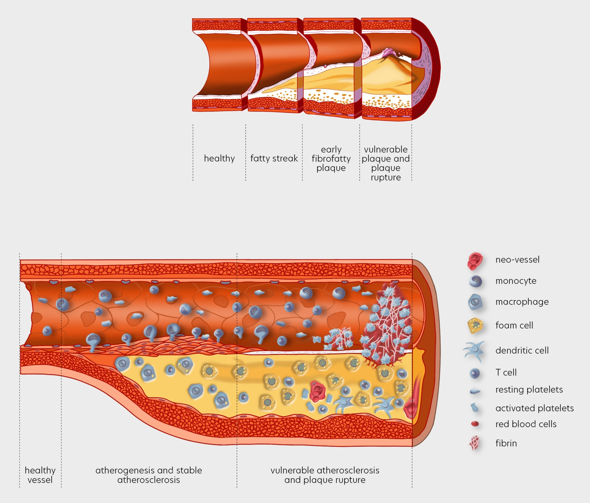

# Introduction to Atherosclerosis and PCSK9 Inhibitor Leqvio

Atherosclerosis is a leading cause of cardiovascular diseases worldwide. Understanding its pathophysiology and exploring innovative treatment options like PCSK9 inhibitors are crucial for advancing cardiovascular health.

## Pathophysiology of Atherosclerosis

Atherosclerosis is a chronic condition characterized by the accumulation of fatty and fibrous materials within the innermost layer of the arteries, known as the intima. This process begins with the buildup of low-density lipoprotein cholesterol (LDL-C), which leads to the formation of atherosclerotic plaques. These plaques can become calcified and fibrous over time, narrowing the arterial lumen and restricting blood flow, potentially causing tissue ischemia.

Atherosclerosis is a major contributor to cardiovascular diseases (CVD), which include conditions such as myocardial infarction (heart attack), ischemic stroke, and peripheral artery disease. The pathogenesis of atherosclerosis involves three main phases: initiation, progression, and complications. During the initiation phase, LDL-C infiltrates the arterial wall, leading to plaque formation. Progression involves the continued accumulation of lipids and inflammatory cells, while complications arise when plaques rupture or erode, causing acute cardiovascular events like heart attacks and strokes (Libby et al).

  
   
  <i>Figure1: Schematic representation of Atherosclerosis stages.</i>

A key player in the development of atherosclerosis is the PCSK9 gene, which regulates the degradation of LDL receptors on liver cells. These receptors are responsible for clearing LDL-C from the bloodstream. Mutations in the PCSK9 gene can lead to higher levels of LDL-C, increasing the risk of atherosclerosis. Conversely, inhibiting PCSK9 can help lower LDL-C levels and reduce the risk of cardiovascular events.

## PCSK9 Mechanisms of Action and Its Inhibition to Control LDL-C

PCSK9 (proprotein convertase subtilisin/kexin type 9) is an essential enzyme involved in cholesterol regulation, particularly low-density lipoprotein cholesterol (LDL-C). It functions by binding to LDL receptors on the surface of liver cells, marking them for degradation. These receptors are vital for clearing LDL-C from the bloodstream. Under normal conditions, LDL receptors bind to LDL particles and internalize them into liver cells, where the particles are broken down, and the receptors are recycled back to the cell surface to repeat the process.

However, when PCSK9 attaches to an LDL receptor, it prevents the receptor from recycling. Instead, the receptor is directed to the lysosome for degradation, reducing the number of LDL receptors available on the cell surface. This reduction leads to higher levels of circulating LDL-C (Roth et al).

  
   
  <i>Figure2: PCSK9 inhibitions of LDL receptors.</i>

Therapies that target the PCSK9 gene represent a novel approach in the management of high cholesterol. These therapies work by inhibiting PCSK9, leading to increased LDL receptor availability and enhanced clearance of LDL-C from the blood. Evidence from clinical research suggests that such treatments can significantly lower LDL-C levels and may provide substantial cardiovascular benefits. By integrating PCSK9 inhibition into treatment regimens, we can offer new hope for patients struggling with high cholesterol and atherosclerosis, potentially reducing the global burden of cardiovascular diseases.

## Disclaimer

I am a Novartis employee. The views and opinions expressed in this blog post are solely my own and do not reflect the official policy or position of Novartis or any of its affiliates. The content provided here is based on peer-reviewed papers and is for informational purposes only. It should not be considered as medical, legal, or professional advice.

## Author's Note

In this article, I’ve looked into the realm of cardiovascular disease, with a spotlight on atherosclerosis and the innovative approach of PCSK9 inhibition. The insights presented are grounded in scientific studies and publicly accessible datasets. This is the result of the collective efforts of many, from public institutions to private companies, and it reflects the dedication of these individuals to develop and bring efficacious drugs to the market for the benefit of all patients. Your feedback and thoughts are immensely appreciated. For further details or to get in touch with me, please visit my [personal page](https://andreagrioni.github.io).

## References and Literature

For those interested in further details, here are some key references:

1. Libby, P., Buring, J. E., Badimon, L., Hansson, G. K., Deanfield, J., Bittencourt, M. S., Tokgözoğlu, L., & Lewis, E. F. (2019). Atherosclerosis. Nature Reviews Disease Primers, 5(56). https://doi.org/10.1038/s41572-019-0106-z
2. Roth, E. M., & Davidson, M. H. (2018). PCSK9 Inhibitors: Mechanism of Action, Efficacy, and Safety. Reviews in Cardiovascular Medicine, 19(S1), 31-46. https://doi.org/10.3909/ricm19S1S0002
3. German, C. A., & Shapiro, M. D. (2019). Small Interfering RNA Therapeutic Inclisiran: A New Approach to Targeting PCSK9. BioDrugs. https://doi.org/10.1007/s40259-019-00399-6
