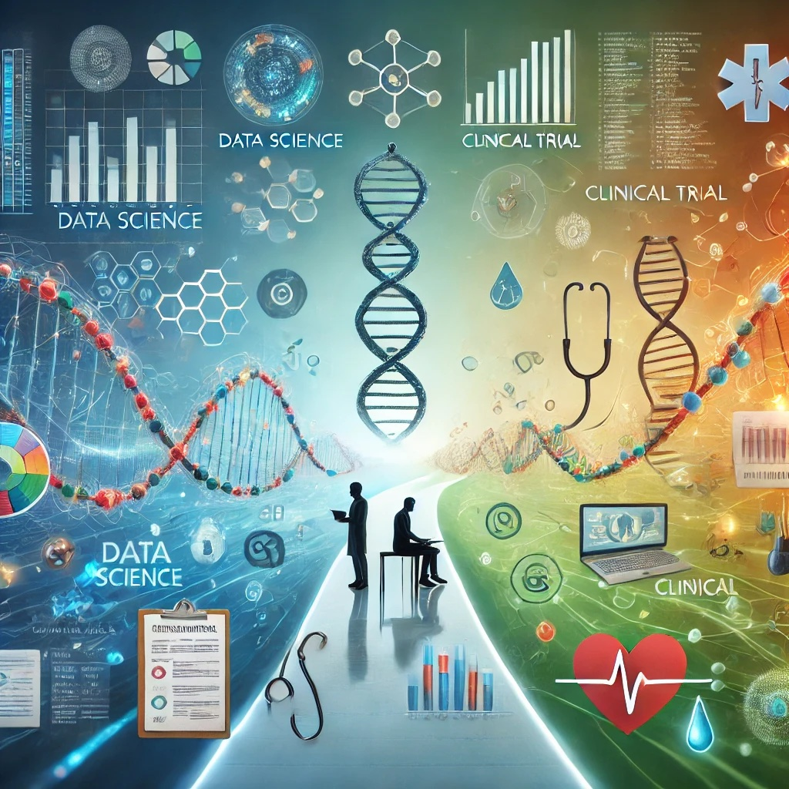

# Driven by Curiosity: Why I Chose a Job Rotation into Clinical Trial Development

In biomarker development, our work typically comes into play at the later stages of the research pipeline, when a compound has already passed through preclinical development and is entering Phase I (first-in-human) and Phase II (early efficacy and safety evaluation). Having spent over three years working with Phase I and II trials, and conducting exploratory biomarker analyses in Phase III (large trials for regulatory submission), it became increasingly clear that a deeper understanding of clinical trial development was essential for driving impactful biomarker strategies.

## Curiosity: Expanding Beyond Biomarker Development

One of the main reasons for this shift was curiosity — a desire to go beyond the niche of biomarker development and gain a broader understanding of how pharmaceutical companies operate. I wanted to see the full picture and understand what happens next after biomarkers are identified. My interest was sparked by reading For Blood and Money: Billionaires, Biotech, and the Quest for a Blockbuster Drug by Nathan Vardi. The book delves into the complex, high-stakes world of drug development and vividly illustrates the strategic importance of clinical trials. It inspired me to explore this space more deeply, particularly how pivotal decisions are made when designing a clinical trial.

Vardi’s book emphasized that selecting the right population, clinical endpoints, and statistical analysis plans is just the beginning. There are also budget constraints, regulatory alignment with authorities like the FDA and EMA, and the delicate balance of risk and reward. All these elements ignited my desire not just to contribute to the exploratory analysis of biomarkers, but to understand and potentially influence the broader clinical trial framework. I began asking questions like: How is a clinical protocol designed to meet both scientific and regulatory standards? What operational strategies ensure effective and ethical patient enrollment? How does the trial operate logistically, from data collection to site selection?

## The Unexpected Twist

Initially, one of the hardest parts of this exploration was accepting that I might need to set aside my data science skills, which I had spent years honing. I assumed clinical trial development would require a different set of skills, leaving little room for the expertise I had built in data science. That thought was difficult to process.

However, as I began learning more about the field, I was surprised to find that my data science skills could still be highly relevant — and even in demand. Clinical trial development appears to offer new opportunities for applying data science, from analyzing patient data to optimizing trial logistics. This discovery has been unexpected but encouraging, showing me that my skillset could continue to contribute across different stages of drug development, expanding the potential impact I can have.

## Skills Upgrade: Building New Competencies for Career Advancement

Another driving force behind this transition was my need to upgrade and diversify my skill set. While technical skills are important, I recognized that soft skills are equally crucial for career growth, especially in leadership positions. This transition offered me an opportunity to develop several key skills that are foundational in clinical development.

* **Regulatory Insights**: Dealing with regulatory bodies like the FDA requires an in-depth understanding of compliance, protocol design, and navigating complex approval processes. Being involved in these discussions offered firsthand experience on how regulatory strategies shape trial success.
* **Study Startup**: I’ve had the opportunity to learn how clinical studies are set up from scratch, including the drafting of informed consent forms, designing pharmacy and laboratory manuals, and participating in study protocol development. This process provided valuable insight into the early planning stages that are critical to a trial’s success.
* **Operational Experience**: In addition to protocol design, I learned how sites are selected, patients are enrolled, and how they are followed up throughout the trial. This operational knowledge is vital to understanding how the logistics of clinical trials unfold. I even encountered discussions on manufacturing challenges, such as selecting the method of drug administration or managing drug storage needs.
* **Management**: One unexpected aspect of this transition was my involvement in executive committee meetings. I participated in high-level discussions, took on organizing roles, and even managed the logistics of in-person meetings, including meeting protocols and follow-ups.
* **Strategy**: Lastly, I gained exposure to the strategic decisions behind trial execution — such as defining criteria for pooling clinical trials, choosing clinical endpoints, and understanding how these decisions impact the labeling and marketing of a drug. It also made me think about the competitive positioning of a drug, not just within the company’s portfolio but against external competitors as well.

## Network: Expanding My Connections

This shift also provided an invaluable opportunity to expand my professional network both within and outside the company. Clinical trial development requires collaboration across various departments — regulatory, operations, medical affairs, and more — giving me a chance to work with a diverse set of professionals I hadn’t interacted with before. These connections not only broaden my understanding but also open doors for future collaborations and career opportunities.

## Learning How a Different Department Works

One of the more practical motivations was simply the need to understand how different departments work within a pharmaceutical company. I was well-versed in biomarker development, but clinical trial development operates in a completely different environment, with its own processes, metrics, and challenges. This experience has allowed me to step into a new world, giving me a holistic view of the drug development process.

In my next post, I’ll share more about how I applied data science within clinical trials and the specific areas where it made a significant difference.

___

Author’s Note

In this article, I’ve shared my experience transitioning from biomarker development into the world of clinical trial development, exploring the challenges, opportunities, and the unexpected relevance of my data science skills. The insights presented here are shaped by my ongoing job rotation and reflect the collaborative nature of pharmaceutical development, where interdisciplinary teams work together to bring innovative therapies to patients. I welcome your feedback and thoughts on this journey. For further details or to get in touch with me, please visit my [personal page](https://andreagrioni.github.io/).

Disclaimer

I am a Novartis employee. The views and opinions expressed in this blog post are solely my own and do not reflect the official policy or position of Novartis or any of its affiliates.