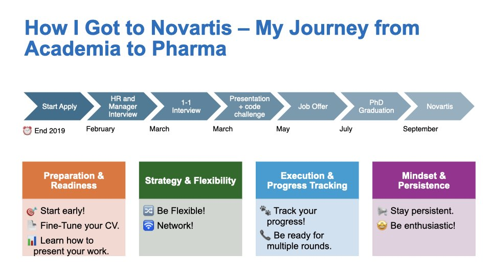

# Introduction

Three weeks ago, I had the privilege of speaking at the Faces of Industrial Research (FIR) conference, a unique event that provides life-science students with a glimpse into the world of industrial research in Swiss biotech companies. The conference aimed to bridge the gap between academia and industry, bringing together scientists from various sectors to showcase their projects and share inspiring career journeys.

My short talk focused on offering insights into how life-science students can successfully transition into industry roles. I discussed strategies for applying to industry positions, what to expect when making the shift, and how to navigate the challenges that come with it.

The entire experience was deeply emotional for me. Seeing the enthusiasm and excitement in the students’ faces reminded me of why I’m so passionate about being part of this pharma journey. The energy around the event reignited my own enthusiasm for the work we do in the industry, and I left feeling truly inspired.

## Slide 1: How I Got to Novartis

### Timing for the Application

I started my job search in late 2019 and decided to apply for a biostatistician position in biomarker development. The application process began in earnest, and I received my first HR call in February 2020. The call was general, assessing my interest in moving to Basel, my reasons for wanting to join Novartis, and my background. They also asked if I was used to working in teams.
Next, I had a 45-minute video call with the hiring manager. The conversation revolved around my work ethic and problem-solving abilities. I was asked questions like, “What would you do if you realized you had sent out a wrong analysis—would you admit it or hide it?” or “Do you give feedback to your manager, or are you a 'yes man'?” The hiring manager also wanted to hear about a time when I had a significant impact or led a project, and they asked about challenges I had faced and how I overcame them.
After that, I had one-on-one conversations with different team members. These were more informal, with questions about specific analyses I had done in the past, including whether I had ever worked with proteomics data.
The final stage of the interview process involved a presentation to the entire team. In the first half, I showcased my PhD project, and in the second half, I took on a project challenge: developing a study plan and analysis strategy to discover genetic markers for Parkinson's disease.
After more than a month, I received the job offer from Novartis, marking the end of a thorough but rewarding process.

### Key Takeaways for Students

- Start Early: The job application process takes time. Begin early to avoid unnecessary stress later. Fine-tune your CV to match the specific job description, and use online tools like Jobscan to check how well your CV aligns with the role you're applying for.
- Practice Your Interview Technique: Exercise how to present yourself effectively by following the STAR framework (Situation, Task, Action, and Results). This will help you prepare for behavioral questions and demonstrate your problem-solving skills.
- Be Flexible: I started as a bioinformatician and applied for a biostatistics position. So, don’t limit yourself to your current role or expertise. Broaden your search and be open to different positions that still align with your skills.
- Networking is Key: Use LinkedIn to connect with people who have similar roles to the ones you're targeting. Reach out for a brief chat to get feedback from the inside. Understand the company’s trajectory, the backgrounds of those in the roles, and the skills required. This gives you valuable insights into what it takes to succeed.
- Track Your Progress: Keep a spreadsheet of all your applications, including the company name, role, date of application, and the outcome. This helps you stay organized and gives you clarity on where you might need to improve your CV or focus your efforts.
- Persistence Pays Off: Expect a low success rate—sometimes 1 in 50 applications will result in an offer. Stay motivated and don’t get discouraged by rejections.
- Prepare for the Interview: Always be enthusiastic and well-prepared. Research the company, dress appropriately, and make sure your video setup is professional. Check the camera angle, lighting, microphone, and background. Some applications may even require you to record a video interaction, which will be filtered by software and human review. Make sure you're ready for these technical aspects!

## Slide 2: The Data Scientist Role in Biomarker Development  
*(Revised for clarity, grammar, and flow)*  

This slide outlines the core activities and responsibilities of a data scientist in biomarker development within translational medicine. Our team bridges **Research and Development**, focusing on **early- to late-stage clinical trials (Phase I–III)**. This role is uniquely rewarding because it combines **clinical data analysis** with the opportunity to see how new drugs directly benefit patients.  

### Key Aspects of the Role:  

**Data Diversity**:  
- **Clinical endpoints**: Laboratory measurements (e.g., cholesterol levels, CRP) and disease-specific biomarkers tied to trial outcomes.  
- **Exploratory biomarkers**: Multi-modal data, including -OMICS, digital (e.g., activity trackers), and imaging.  
  - *Note*: Expertise in one domain is sufficient; collaboration fills knowledge gaps.  

**Cross-Functional Collaboration**:  
We partner with teams across Novartis—Research, Clinical Development, Regulatory, Medical Affairs, and Marketing—to align on:  
- Analysis plans, priorities, and results interpretation.  
- Strategies to address business and scientific goals.  

### Business-Driven Impact Areas:  

1. **Regulatory Submissions**:  
   - Analyze biomarker data (targeted assays, OMICS, imaging) to demonstrate a drug’s superiority over standard care.  
   - *Example*: Validating a biomarker’s link to disease severity ensures robust evidence for regulatory approval.  

2. **Back-Translational Research**:  
   - Leverage clinical trial data to inform early-stage drug development.  
   - *Example*: Phase III insights for Compound A guide improvements in its next-generation successor.  

3. **Scientific Communication**:  
   - Partner with Medical Affairs to publish findings in journals or present at conferences (e.g., ASCO, EHA).  
   - *Goal*: Build scientific credibility and awareness of Novartis’ innovations.  

### Lesson Learned:  
Technical excellence alone isn’t enough. Success hinges on:  
- Aligning with stakeholders in cross-departmental matrixes.  
- Proactively communicating impact to senior leadership.  

## Slide 3: Making Your Work Visible: Presentation & Advocacy in Biomarker Development

Building on the lesson learned—visibility and advocacy are as critical as technical expertise—here’s how to amplify your impact in a cross-functional environment:

### Proactively Seek Presentation Opportunities

- Internal Platforms: Share findings in senior leadership meetings, cross-departmental forums, or internal symposia. For example, present biomarker analysis results during regulatory submission updates to highlight their role in drug approval.
- External Channels: Advocate to represent your work at scientific conferences (e.g., ASCO, AHA, ASN, ACC) or publish in journals. This not only builds your credibility but also elevates Novartis’ scientific reputation.
- Network Strategically Beyond Your Immediate Team: Engage stakeholders in Research, Development, and Medical Affairs early in projects. For instance, collaborate with Medical Affairs to shape scientific narratives for conferences, ensuring your biomarker insights are part of key messaging. Schedule informal “impact updates” with your manager and senior leaders to align your work with broader business goals, such as accelerating back-translational research for pipeline compounds.
- Frame Technical Work as Impact-Driven Stories: Translate complex analyses into business outcomes. Instead of stating, “We analyzed CRP levels,” say, “Our biomarker analysis demonstrated a 30% reduction in disease severity, supporting the differentiation of Compound A versus standard therapy.” Tie your contributions to patient impact: “This digital biomarker model identifies responders 6 months earlier, potentially speeding up trial enrollment for Phase III.”
- Highlight Teamwork to Strengthen Collaborations: Acknowledge cross-functional partners in presentations or reports. For example, credit Regulatory Affairs for guiding submission strategies or Clinical Trial teams for data collection rigor.
Use phrases like, “Through collaboration with X team, we uncovered…” to position yourself as a bridge-builder while ensuring visibility.

Takeaway: Visibility isn’t self-promotion—it’s ensuring your work informs decisions, drives drug development, and reaches patients. 

Start small: Identify one upcoming forum this quarter to present your contributions, and prepare a 3-minute “impact story” to share with a leader outside your direct team.

## Slide 4: See the Big Picture and Take Initiative  

**Strategic advice for intentional career growth.**  

---

## Developing a Vision  
- **Define where you want to go**: Reflect on long-term aspirations. What roles, skills, or impact do you want in 3–5 years?  
- **Write a development plan with timeline**: Break goals into milestones (e.g., "Master biomarker validation techniques by Q3").  
- **Align with mentors, sponsors, and managers**: Share your vision to gain feedback and advocacy. Example: “I aim to lead cross-functional projects—how can I prepare?”  

---

## Taking Initiative  
- **Seek opportunities that align with your goals**:  
  - Volunteer for high-visibility projects (e.g., lead a biomarker analysis for a Phase III trial).  
  - Propose new ideas (e.g., “Let’s pilot a machine learning model for digital biomarker discovery”).  
  - *Pro tip*: Track and communicate your contributions quarterly to leadership.  

---

## Build Support  
- **Cultivate mentor/sponsor relationships**:  
  - Sponsors advocate for promotions; mentors guide skill development.  
  - Schedule quarterly check-ins to discuss progress and roadblocks.  
- **Network strategically**:  
  - Identify skills needed for your next role through informational interviews.  
  - Example: Connect with Regulatory Affairs to understand submission processes.

---

## Professional Growth  
- **Gain cross-functional experience**:  
  - Take lateral moves (e.g., join a translational research team for 6 months).  
  - Participate in stretch assignments (e.g., co-author a manuscript with Medical Affairs).  
- **Increase long-term opportunities**:  
  - Build a “T-shaped” skill set: Deep expertise in biomarkers + broad knowledge of drug development.  

---

## Career Expansion  
**Growth happens when you take ownership of your career!**  
- **Own your narrative**: Frame your achievements as stepping stones toward your vision.  
- **Measure progress**: Revisit your development plan annually and adjust based on feedback.  
- **Stay agile**: Embrace challenges—they’re opportunities to expand your impact.  

*Next steps: Draft your 1-year development plan this week and share it with a mentor.*  

### Final Thoughts: A Humble Perspective  

Thank you for reading through my reflections! This advice stems from my **5 years in a leading pharma company**, but it’s just *one perspective*—not a gold standard. Career paths evolve, and so will my views.  

A few parting reminders:  
- **Failure is part of growth**: Mistakes are okay. What matters is learning, adapting, and asking, *“What could I have done better?”*  
- **Stay curious and humble**: Seek environments that challenge you. If growth stalls internally, explore external forums, courses (Coursera, etc.), blogs, or non-profit initiatives.  
- **Network relentlessly**: Ask others, *“How did you get here? What skills matter? Who else should I talk to?”*  

If you find this useful, **I’m happy to help** within my capacity—whether through a short call, feedback on your plan, or sharing resources. I’m still learning too, and I value your insights as much as you might value mine.  

**Feel free to reach out**, and thank you again for your time!  

*— Andrea*  