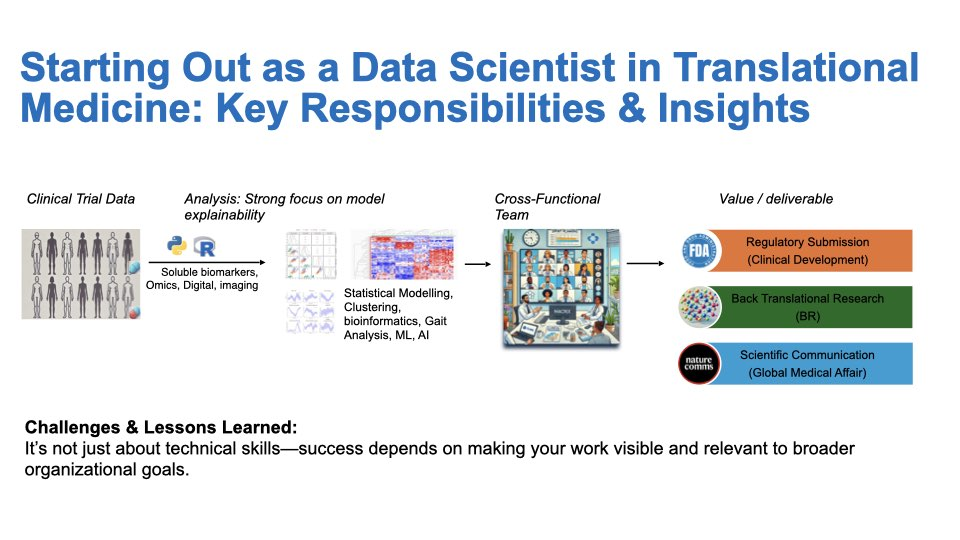
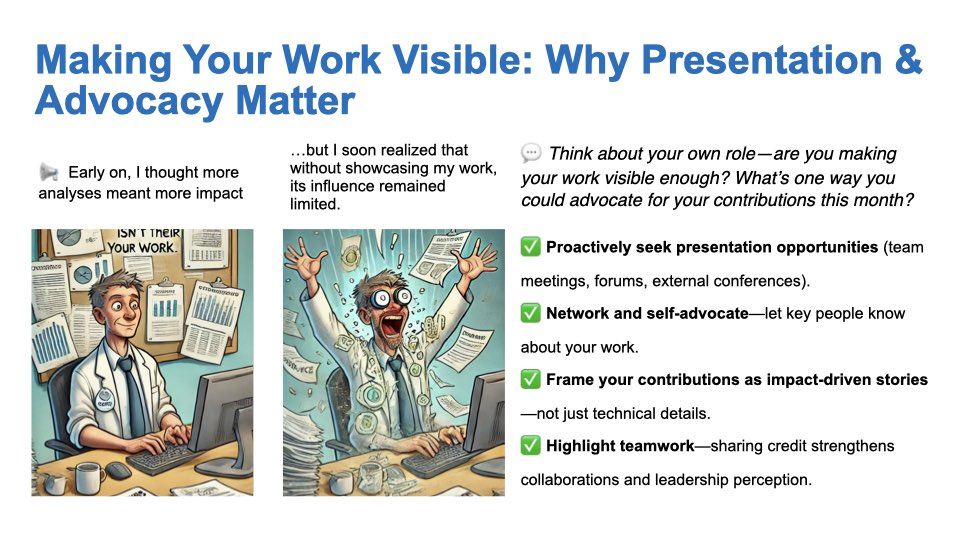
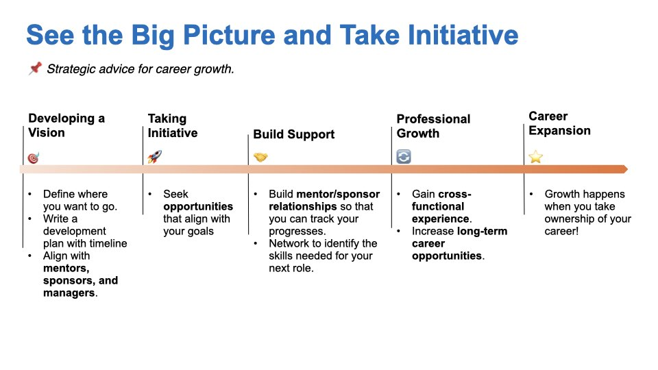

# Introduction

Three weeks ago, I had the privilege of speaking at the Faces of Industrial Research (FIR) conference—a unique event that offers life-science students a glimpse into industrial research at Swiss biotech companies. The conference aims to bridge the gap between academia and industry by bringing together scientists from various sectors to showcase their projects and share inspiring career journeys.

My talk focused on how life-science students can successfully transition into industry roles. I covered strategies for applying to industry positions, what to expect during the transition, and how to navigate the associated challenges.

The experience was deeply moving. Seeing the enthusiasm on the students’ faces reminded me why I’m so passionate about the pharma journey. The event’s energy rekindled my enthusiasm for our work in the industry, leaving me truly inspired.

## Slide 1: How I Got to Novartis

### Timing for the Application

I began my job search in late 2019 and decided to apply for a biostatistician position in biomarker development. The process started earnestly when I received my first HR call in February 2020. That call focused on my interest in relocating to Basel, my reasons for joining Novartis, and my background—including teamwork experience.

Next, I had a 45-minute video call with the hiring manager, where we discussed my work ethic and problem-solving skills. I was asked questions such as, “What would you do if you realized you had sent out an incorrect analysis—would you admit it or conceal it?” and “Do you provide feedback to your manager, or are you a 'yes man'?” The manager also asked about a time when I made a significant impact or led a project, including the challenges I faced and how I overcame them.

After that, I participated in one-on-one conversations with various team members. These informal discussions included inquiries about specific analyses I had conducted, such as whether I had experience with proteomics data.

The final stage involved a presentation to the entire team. In the first half, I showcased my PhD project; in the second half, I tackled a project challenge by developing a study plan and analysis strategy to discover genetic markers for Parkinson's disease.

After more than a month, I received a job offer from Novartis, marking the end of a thorough yet rewarding process.

### Key Takeaways for Students

- **Start Early:** The job application process takes time. Begin early to avoid unnecessary stress. Tailor your CV to match the job description, and use tools like Jobscan to assess your CV’s alignment with the role.
- **Practice Your Interview Technique:** Prepare for behavioral questions using the STAR framework (Situation, Task, Action, and Results) to effectively showcase your problem-solving skills.
- **Be Flexible:** I transitioned from a bioinformatician role to a biostatistician position. Broaden your search and be open to opportunities that align with your skills.
- **Networking is Key:** Connect with professionals on LinkedIn who hold the roles you’re targeting. Engage in brief chats to gain insights into the company’s trajectory, required skills, and success factors.
- **Track Your Progress:** Keep a spreadsheet of your applications, including company names, roles, application dates, and outcomes. This helps identify areas for improvement.
- **Persistence Pays Off:** Expect a low success rate—sometimes only 1 in 50 applications results in an offer. Stay motivated and learn from rejections.
- **Prepare for the Interview:** Research the company, dress appropriately, and ensure your video setup is professional. Check your camera angle, lighting, microphone, and background. Some interviews may even require you to record a video, which will be reviewed by both software and humans—so be ready for these technical aspects.

## Slide 2: The Data Scientist Role in Biomarker Development  

This slide outlines the core activities and responsibilities of a data scientist in biomarker development within translational medicine. Our team bridges **Research and Development**, focusing on **early- to late-stage clinical trials (Phase I–III)**. This role is uniquely rewarding, as it combines **clinical data analysis** with the opportunity to witness how new drugs directly benefit patients.

### Key Aspects of the Role

**Data Diversity:**
- **Clinical Endpoints:** Laboratory measurements (e.g., cholesterol levels, CRP) and disease-specific biomarkers tied to trial outcomes.
- **Exploratory Biomarkers:** Multi-modal data, including -OMICS, digital (e.g., activity trackers), and imaging.
  - *Note:* Expertise in one domain is sufficient; collaboration fills any knowledge gaps.

**Cross-Functional Collaboration:**
We work closely with teams across Novartis—Research, Clinical Development, Regulatory, Medical Affairs, and Marketing—to align on:
- Analysis plans, priorities, and results interpretation.
- Strategies addressing both business and scientific objectives.

### Business-Driven Impact Areas

1. **Regulatory Submissions:**
   - Analyze biomarker data (targeted assays, OMICS, imaging) to demonstrate a drug’s superiority over standard care.
   - *Example:* Validating a biomarker’s link to disease severity can provide robust evidence for regulatory approval.

2. **Back-Translational Research:**
   - Leverage clinical trial data to inform early-stage drug development.
   - *Example:* Phase III insights for Compound A may guide improvements in its next-generation successor.

3. **Scientific Communication:**
   - Collaborate with Medical Affairs to publish findings in journals or present at conferences (e.g., ASCO, EHA).
   - *Goal:* Build scientific credibility and increase awareness of Novartis’ innovations.

### Lesson Learned

Technical excellence alone isn’t enough. Success depends on:
- Aligning with stakeholders across departments.
- Proactively communicating your impact to senior leadership.

## Slide 3: Making Your Work Visible: Presentation & Advocacy in Biomarker Development

Visibility and advocacy are as crucial as technical expertise. Here’s how to amplify your impact in a cross-functional environment:

### Proactively Seek Presentation Opportunities

- **Internal Platforms:** Share your findings at senior leadership meetings, cross-departmental forums, or internal symposia. For example, present biomarker analysis results during regulatory submission updates to emphasize their role in drug approval.
- **External Channels:** Represent your work at scientific conferences (e.g., ASCO, AHA, ASN, ACC) or through publications. This not only builds your credibility but also elevates Novartis’ scientific reputation.
- **Network Strategically:** Engage with stakeholders from Research, Development, and Medical Affairs early in projects. Collaborate with Medical Affairs to shape scientific narratives for conferences, ensuring your biomarker insights contribute to key messaging. Additionally, schedule informal “impact updates” with your manager and senior leaders to align your work with broader business goals, such as accelerating back-translational research for pipeline compounds.
- **Frame Technical Work as Impact-Driven Stories:** Translate complex analyses into clear business outcomes. Instead of simply stating, “We analyzed CRP levels,” you might say, “Our biomarker analysis demonstrated a 30% reduction in disease severity, supporting Compound A’s differentiation from standard therapy.” Emphasize how your contributions translate to better patient outcomes.
- **Highlight Teamwork:** Acknowledge cross-functional partners in your presentations or reports. For example, credit Regulatory Affairs for guiding submission strategies or Clinical Trial teams for their role in rigorous data collection.

**Takeaway:** Visibility isn’t about self-promotion—it’s about ensuring your work informs decisions, drives drug development, and ultimately benefits patients.

Start small: Identify an upcoming forum this quarter to present your contributions, and prepare a concise “impact story” to share with a leader outside your immediate team.

## Slide 4: See the Big Picture and Take Initiative

**Strategic advice for intentional career growth.**

### Developing a Vision

- **Define Your Goals:** Reflect on your long-term aspirations. What roles, skills, or impacts do you envision in 3–5 years?
- **Create a Development Plan:** Outline your goals with specific milestones (e.g., "Master biomarker validation techniques by Q3").
- **Align with Mentors and Managers:** Seek advice from your line manager, but also look for a senior colleage interested in mentioring you. Share your vision to gain feedback and advocacy. For example, ask, “I aim to lead cross-functional projects—how can I prepare?”

### Taking Initiative

- **Seek Aligned Opportunities:** Volunteer for high-visibility projects, such as leading a biomarker analysis for a Phase III trial, or participate / lead an innovative project (e.g. develop an AI model or drive the adoption of Generative AI)
- **Propose New Ideas:** For instance, “Let’s pilot a machine learning model for digital biomarker discovery.”
- **Track and Communicate Contributions:** Regularly update leadership on your progress, ideally on a quarterly basis.

### Building Support

- **Cultivate Mentor/Sponsor Relationships:**
  - Sponsors advocate for promotions, while mentors guide your skill development.
  - Schedule quarterly check-ins to discuss progress and address challenges.
- **Network Strategically:**
  - Identify the skills needed for your next role through informational interviews.
  - For example, connect with Regulatory Affairs to understand submission processes.

### Professional Growth

- **Gain Cross-Functional Experience:**
  - Consider lateral moves, such as joining a translational research team temporarily.
  - Participate in stretch assignments, like co-authoring a manuscript with Medical Affairs.
- **Develop a T-Shaped Skill Set:** Build deep expertise in biomarkers while acquiring broad knowledge of drug development.

### Career Expansion

**Growth happens when you take ownership of your career!**
- **Own Your Narrative:** Frame your achievements as milestones aligned with the company goals and your long-term vision.
- **Measure Your Progress:** Regularly review your development plan and adjust it based on constructive feedback.
- **Stay Agile:** Embrace challenges as opportunities to broaden your impact—whether through internal projects or personal initiatives.
- **Build Your Non-Technical Skills:** Enhance your understanding of relevant topics by taking internal courses or online classes (e.g., Coursera). Pursue certifications from reputable institutions like Microsoft, AWS, IBM, or certifications in Good Clinical Practice. Stay curious, keep learning, and remain informed.

*Next steps: Draft your one-year development plan this week and share it with a mentor.*

## Final Thoughts: A Humble Perspective

Thank you for reading my reflections. This advice is based on my **five years** in a leading pharma company and represents just *one perspective*—not a definitive roadmap. Career paths evolve, and so do our views.

A few parting reminders:
- **Failure is Part of Growth:** Mistakes are opportunities to learn, adapt, and improve.
- **Stay Curious and Humble:** Seek out challenging environments. If growth stalls internally, explore external forums, online courses (e.g., Coursera), blogs, or non-profit initiatives.
- **Network Relentlessly:** Ask questions like, “How did you get here? What skills are crucial? Who else should I connect with?”

If you find this advice useful, **I’m happy to help**—whether through a brief call, feedback on your development plan, or sharing resources. I’m still learning, and I value your insights as much as you might value mine.

**Feel free to reach out, and thank you for your time!**

*— Andrea*